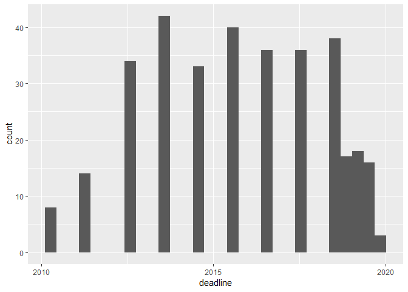
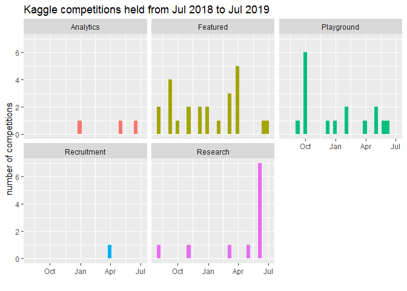
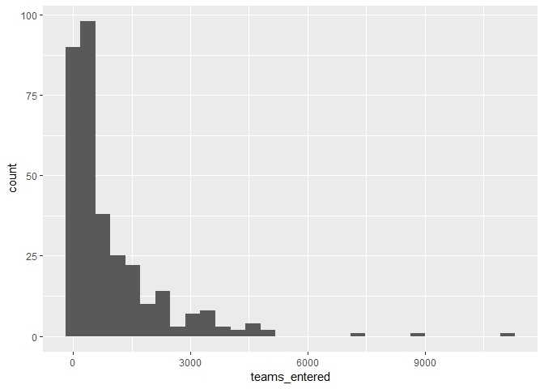
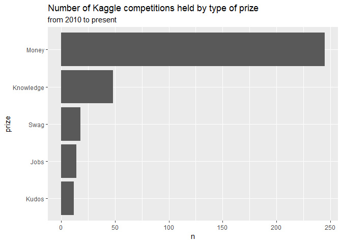
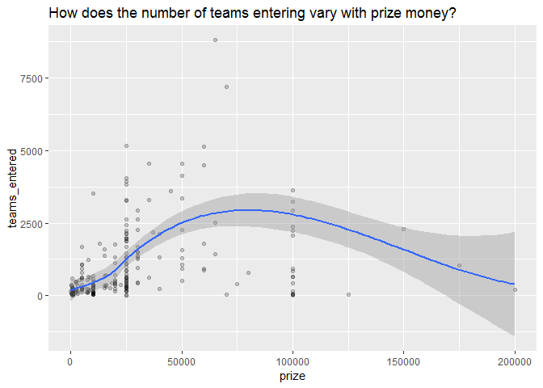

Kaggle
======

Today I collected all the brief competition descriptions on the Kaggle website. I'm interested in how often data science for good type competitions were held and under what conditions. I'd also like to know how they compare to other types of competitions held.

``` r
library(tidyverse)
library(lubridate)
library(here)
kaggle <- read_csv(here("data/kaggle_competitions.csv"))

str(kaggle, give.attr = F)
```

    ## Classes 'spec_tbl_df', 'tbl_df', 'tbl' and 'data.frame': 339 obs. of  9 variables:
    ##  $ title             : chr  "Predict Future Sales" "iMaterialist (Fashion) 2019 at FGVC6" "iNaturalist 2019 at FGVC6" "Google Landmark Recognition 2019" ...
    ##  $ short_desc        : chr  "Final project for \"How to win a data science competition\" Coursera course" "Fine-grained segmentation task for fashion and apparel" "Fine-grained classification spanning a thousand species" "Label famous (and not-so-famous) landmarks in images" ...
    ##  $ category          : chr  "Playground" "Research" "Research" "Research" ...
    ##  $ prize             : chr  "Kudos" "Kudos" "Kudos" "$25,000" ...
    ##  $ tags              : chr  NA NA NA NA ...
    ##  $ kernels_comp      : chr  NA NA NA NA ...
    ##  $ submission_details: chr  NA NA NA NA ...
    ##  $ teams_entered     : num  3281 203 209 281 144 ...
    ##  $ deadline          : Date, format: "2020-01-02" "2019-06-10" ...

``` r
summary(kaggle$deadline)
```

    ##         Min.      1st Qu.       Median         Mean      3rd Qu. 
    ## "2010-06-06" "2013-06-05" "2015-06-05" "2015-10-22" "2018-06-04" 
    ##         Max.         NA's 
    ## "2030-06-01"          "3"

There's 339 competitions listed today, most of which have likely finished, lets start with deadlines to get a sense of how many competitions are closing at any time.

``` r
kaggle %>% 
  filter( deadline < ymd(20210101)) %>% 
  ggplot(aes(deadline)) +
  geom_histogram()
```

    ## `stat_bin()` using `bins = 30`. Pick better value with `binwidth`.



In recent years, there's been about 35 competitions per year. For the most recent year we can get monthly data, but the deadline is aggregated by year for others because it was derived from statements like "2 years ago".

We can break out the type of comptition held in most recent years.

``` r
kaggle %>% 
  filter( between(deadline, ymd(20180701), ymd(20190701)) ) %>% 
  ggplot(aes(deadline, fill = category)) +
  geom_histogram() +
  facet_wrap(~ category) +
  scale_x_date(date_labels = "%b") +
  labs(title = "Kaggle competitions held from Jul 2018 to Jul 2019", 
       x = "",
       y = "number of competitions") +
  guides(fill = F)
```

    ## `stat_bin()` using `bins = 30`. Pick better value with `binwidth`.



Just to be sure, what type of competitions to data science for good one's get categorized as?

``` r
kaggle %>% 
  filter(str_detect(title, "Good"))
```

    ## # A tibble: 2 x 9
    ##   title short_desc category prize tags  kernels_comp submission_deta~
    ##   <chr> <chr>      <chr>    <chr> <chr> <chr>        <chr>           
    ## 1 Data~ Help the ~ Analyti~ $15,~ imag~ <NA>         <NA>            
    ## 2 Data~ Match car~ Analyti~ $15,~ chil~ <NA>         <NA>            
    ## # ... with 2 more variables: teams_entered <dbl>, deadline <date>

There's been two other Data Science for Good competitions (\[Data Science for Good: Center for Policing\] Equity(<https://www.kaggle.com/center-for-policing-equity/data-science-for-good/kernels>) and [Data Science for Good: PASSNYC](https://www.kaggle.com/passnyc/data-science-for-good/kernels)), however they've been taken off the listings for some reason.

The Data Science for Good competitions are also unique in that they don't have a leaderboard so there is no measure for teams entered. One possible way to still count this would be to perhaps count the unique user codes that are active on the competition (through some measure of kernels or discussions).

That cuts this comparison short, but we can still look at some broad summaries of the rest of Kaggle's competitions. For instance, many teams typically enter a competition?

``` r
kaggle %>% 
  ggplot(aes(teams_entered)) +
  geom_histogram()
```

    ## `stat_bin()` using `bins = 30`. Pick better value with `binwidth`.

    ## Warning: Removed 10 rows containing non-finite values (stat_bin).



Most appear to have something in the 10 to 500 range, but there are some serious outliers with over 6,000 teams. Which one's were these?

``` r
kaggle %>% 
  filter(teams_entered > 6000) %>% 
  select(-kernels_comp, -submission_details, -tags, -category, -deadline)
```

    ## # A tibble: 3 x 4
    ##   title              short_desc                        prize  teams_entered
    ##   <chr>              <chr>                             <chr>          <dbl>
    ## 1 Titanic: Machine ~ Start here! Predict survival on ~ Knowl~         11128
    ## 2 Santander Custome~ Can you identify who will make a~ $65,0~          8802
    ## 3 Home Credit Defau~ Can you predict how capable each~ $70,0~          7198

The ongoing Titanic competition takes the lion's share, a gateway to data science that many people try when they first hear of it (including me!). The others look like they have to do with financial data.

Speaking of which, there's a prize amount for some Kaggle competitions so we should definitely take a look at how much prize money typically gets offered and how it can influence the number of teams entered.

``` r
kaggle %>% 
  filter(prize != "USD") %>% 
  mutate( prize = if_else(str_detect(prize, "[\\$\\€]"), "Money", prize)) %>% 
  count(prize) %>% 
  mutate(prize = reorder(prize, n)) %>% 
  ggplot(aes(prize, n)) +
  geom_col() +
  coord_flip() +
  labs( title = "Number of Kaggle competitions held by type of prize",
        subtitle = "from 2010 to present")
```



Money is certain the most popular prize.

``` r
# need to clean the prize variable so it's a number
kaggle_prizes <- kaggle %>%
  # we'll drop the one prize offered in euros
  filter(str_detect(prize, "[\\$]") ) %>% 
  mutate(prize = as.numeric(str_replace_all(prize, "[\\$,]", "")))

summary(kaggle_prizes$prize)
```

    ##    Min. 1st Qu.  Median    Mean 3rd Qu.    Max. 
    ##       0    5000   20000   43298   30000 1500000

Wait up, some competitions offered *how much* as prize money? These prizes are often a pool split amongst several top finishers, but that's a lot of zeros! Lets filter out anything over $500,000 as these are truly unique. Which one's were they anyway?

``` r
kaggle_prizes %>% 
  filter(prize > 500000) %>% 
  select(-kernels_comp, -submission_details, -tags, -category, -deadline)
```

    ## # A tibble: 3 x 4
    ##   title                 short_desc                      prize teams_entered
    ##   <chr>                 <chr>                           <dbl>         <dbl>
    ## 1 Zillow Prize: Zillow~ Can you improve the algorithm~ 1.20e6          3779
    ## 2 Passenger Screening ~ Improve the accuracy of the D~ 1.50e6           518
    ## 3 Data Science Bowl 20~ Can you improve lung cancer d~ 1.00e6          1972

Interesting, there's a Public Sector competition on passenger screening from the US Department of Homeland Security. The goal was to "Improve the accuracy of the Department of Homeland Security's threat recognition algorithms". Here's a [link](https://www.kaggle.com/c/passenger-screening-algorithm-challenge). It certainly looks like the number of teams that entered didn't necessarily increase proportionally to the size of the prize of $1.5 million dollars - the largest Kaggle has ever seen.

``` r
kaggle_prizes %>% 
  filter(prize < 500000) %>% 
  ggplot(aes(prize, teams_entered)) +
  geom_point(alpha = 0.2) +
  geom_smooth() +
  labs(title = "How does the number of teams entering vary with prize money?")
```

    ## `geom_smooth()` using method = 'loess' and formula 'y ~ x'

    ## Warning: Removed 8 rows containing non-finite values (stat_smooth).

    ## Warning: Removed 8 rows containing missing values (geom_point).



There's likely some explanatory power of prize money, but the number of teams entering is likely a little more complicated story. Especially beyond $100,000 where it actually begins to decrease. Perhaps this is because of the nature of competitions offering greater prizes: they could be more challenging.
